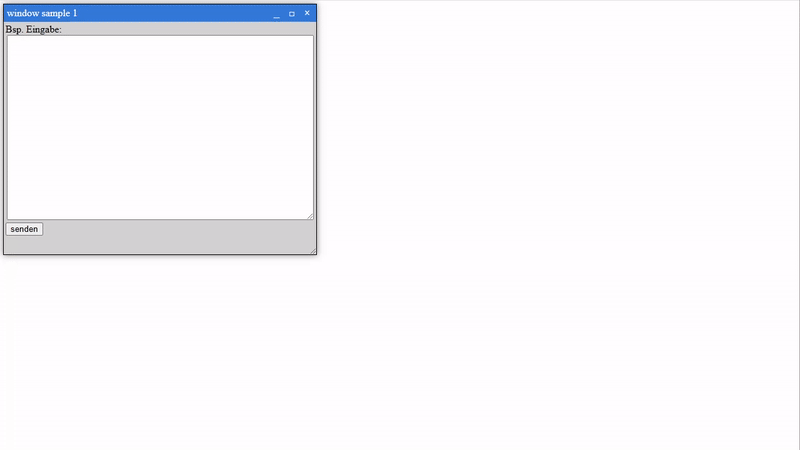

# CopyPasteScripts
A collection of small, reusable scripts for quick copy-pasting into your projects. Some parts were created with AI. Licensed under CC-BY-SA-4.0: you can use, share, and adapt them with proper attribution, and any modifications must be shared under the same license.

## VanillaJS-FloatingWindow
[VanillaJS-FloatingWindow](VanillaJS-FloatingWindow/)

This code is designed to create interactive, movable, and resizable "windows" on a webpage, much like the windows you use on a computer desktop. Each window includes a title bar with controls to minimize, maximize, or close it, along with a space to display custom content. You can drag the windows around the screen by clicking and holding the title bar, and resize them by dragging the bottom-right corner. The minimize button shrinks the window and moves it to the top of the screen, while the maximize button makes it fill the entire screen. The close button removes the window, but only if a condition allows it.

The system is designed to handle multiple windows at the same time, ensuring the one you interact with comes to the front. It saves certain settings, such as whether a window is minimized, so they can be restored the next time the page is loaded. The windows have a modern design with shadows and color styling, making them visually appealing and user-friendly. They can be used for various tasks, like displaying information or interacting with elements on the page, and work together without overlapping issues. This code essentially transforms a webpage into a dynamic, desktop-like environment where users can organize and interact with content efficiently.

[example code with one window](VanillaJS-FloatingWindow/ExampleWindowUseage.html)
 
[example code with two windows](VanillaJS-FloatingWindow/ExampleTwoWindows.html)

https://raw.githubusercontent.com/grayoctagon/CopyPasteScripts/refs/heads/main/assetsForGit/VanillaJS-FloatingWindow.mp4

## License: 
Attribution-ShareAlike 4.0 International CC-BY-SA 

(details see LICENSE.txt file)

